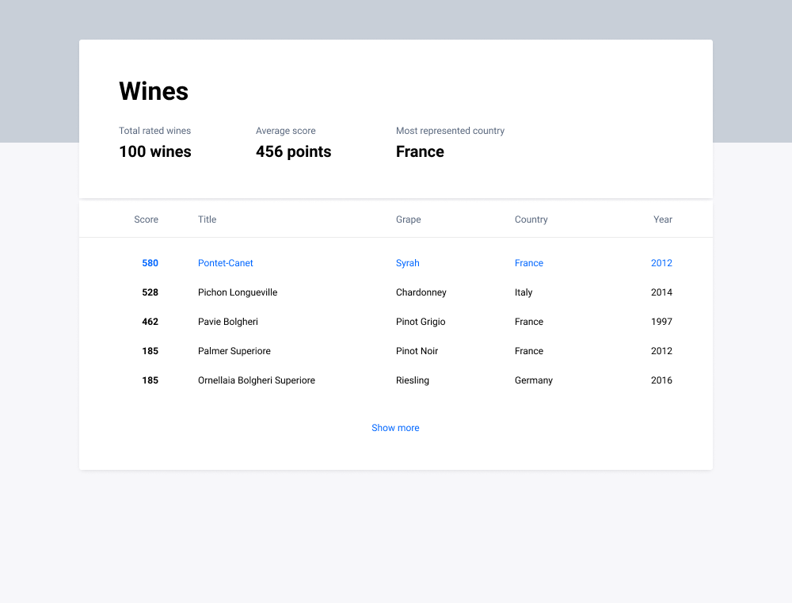
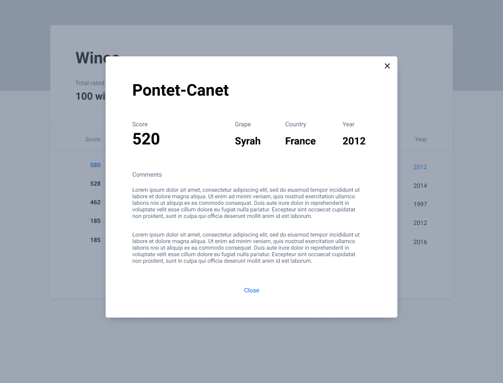

# The Task:

Your missions is to implement design and use provided data:

1) Implement provided design
2) Fetch list of wines from our server
3) Adapt the list into design
4) Share your code solution with us

## 1) Implement provided design

Implement design with technologies you like.

Use of ReactJs or Vue.js frameworks is prefered.




You can use dummy data on this step.

## 2) Fetch list of wines from our server

* **URL**

https://api-staging.vello.fi/front-challenge-2020/wine

* **Method:**

  <_The request type_>

	`GET`

* **Query Parameters**

  **Optional**

	`limit=[integer]`

	`last=[id of the last field in response]`

* **Example request:**

```
GET https://api-staging.vello.fi/front-challenge-2020/wine

200 OK
{
  "items": {
    "11fbf23b-eb94-4e01-a4a5-5892fceca63a": {
      "name": "Sleepy Green Clam",
      "grape": "Pinot Noir",
      "year": 2003,
      "score": 81,
      "comments": [
        {
          "upvotes": 10,
          "downvotes": 2,
          "text": "Best wine I ever had!"
        },
        {
          "upvotes": 1,
          "downvotes": 0,
          "text": "Very good!"
        }
      ]
    },
    "7a83388b-70f4-495c-a85f-692f789c6fe5": {
      "name": "Homey Khaki Gar",
      "grape": "Petite Verdot",
      "year": 2019,
      "score": 60,
      "comments": [
      ]
    }
  },
  "last": "... ID of last read element ...",
  "has_more": true
}
```

## 3) Adapt the list into design

Now you have to use received data in the design.

## 4) Share your code solution with us

Share your solution and code from Github, using email, FAX. Style is free.

If you have any questions please contact Vello Team:

Tuomas Nylund tuomas.nylund@vello.fi

Good Luck! We will be glad to talk about your solution.
